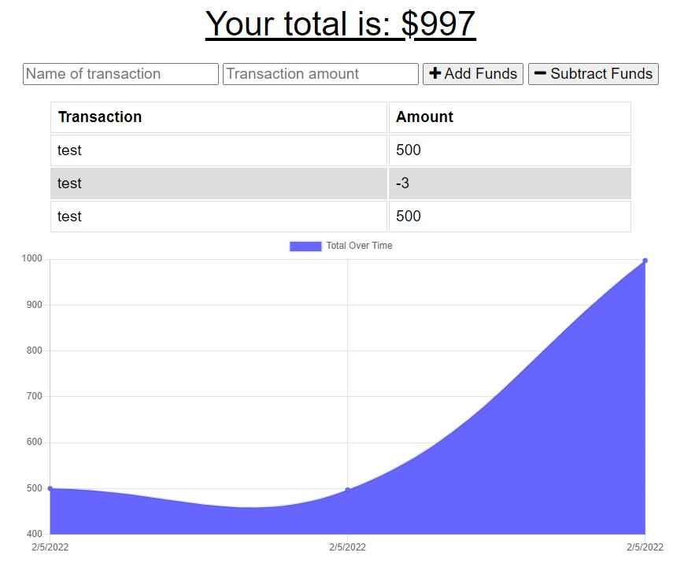

# Budget-Tracker

  ## Description
  This is a progressive web api that is deployed to Heroku that can process transactions when the website is offline.

  ## Table of Contents
  * [Installation](#installation)
  * [Usage](#usage)
  * [License](#license)
  * [Contributing](#contributing)
  * [Tests](#tests)
  * [Questions](#questions)
  
  ## Project Image
  
  
  ## Installation 
  Go to https://glacial-hamlet-24067.herokuapp.com/ to run the app

  ## Usage 
  A app to track your budget.

  ## License 
  This project is licensed under no license.

  ## License Link
  

  ## Contributing 
  Contact me to contribute.

  ## Tests
  n/a

  ## Questions
  If you have any questions about this projects, please contact me directly at travis.helms@gmail.com. You can view more of my projects at https://github.com/SmasherCoder.

